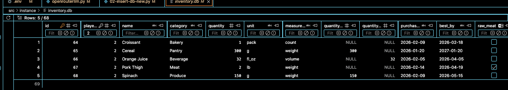

5. Evaluation Starter Kit (Minimum 20 Test Cases)
Create:

/docs/evaluation_test_cases.md
Include 20 scenarios with:

Pantry snapshot (ingredients + quantities + expiry)
Expected feasibility result (Pass/Fail)
Generated recipe output
Validator output
Notes (what failed and why, if fail)
Required metrics
Feasibility pass rate
“Invented ingredient” rate (should be 0 in default mode)
Expiry utilization rate (if you claim expiry-first)
Average regeneration attempts (if using regenerate-on-fail)

> click on Images on Pantry Snapshot for better view

# Test Cases

| ID | Test Case Name | Pantry Snapshot | Expected Result | Actual Result | Status (✅/❌) |
| :--- | :--- | :--- | :--- | :--- | :--- |
| **01** | | | | | |
| **02** | | | | | |
| **03** | | | | | |
| **04** | | | | | |
| **05** | | | | | |
| **06** | | | | | |
| **07** | | | | | |
| **08** | | | | | |
| **09** | | | | | |
| **10** | | | | | |
| **11** |Pantry with a good amount of inventory|  | | | |
| **12** | | | | | |
| **13** | | | | | |
| **14** | | | | | |
| **15** | | | | | |
| **16** | | | | | |
| **17** | | | | | |
| **18** | | | | | |
| **19** | | | | | |
| **20** | | | | | |

