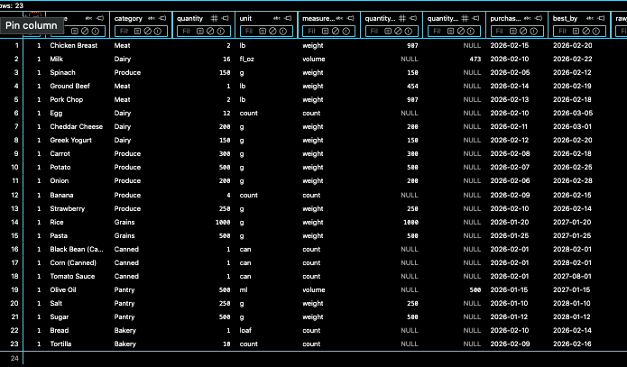

5. Evaluation Starter Kit (Minimum 20 Test Cases)
Create:

/docs/evaluation_test_cases.md
Include 20 scenarios with:

Pantry snapshot (ingredients + quantities + expiry)
Expected feasibility result (Pass/Fail)
Generated recipe output
Validator output
Notes (what failed and why, if fail)
Required metrics
Feasibility pass rate
“Invented ingredient” rate (should be 0 in default mode)
Expiry utilization rate (if you claim expiry-first)
Average regeneration attempts (if using regenerate-on-fail)

> click on Images on Pantry Snapshot for better view

# Test Cases

| ID | Test Case Name | Pantry Snapshot | Expected Result | Actual Result | Status (✅/❌) | Notes |
| :--- | :--- | :--- | :--- | :--- | :--- | :--- |
| **01** |Not Enough Sugar | |Pass |Pass:     |✅ |Scaled down the recipe |
| **02** |Expired Chicken Breast | |Pass |Pass:    |✅ |Did not generate a recipe with expired ingredient |
| **03** |Cherries Are Not in the Inventory | |Pass |Pass:    |✅ |Did not generate a recipe with an item not in the inventory |
| **04** |Expired Milk | |Pass |Pass:     |✅ |Did not generate a recipe with expired ingredient |
| **05** |Expiry First | |Pass |Pass:    |✅ |Recommended a recipe with expiring ingredients |
| **06** |Non-food Item | |Pass |Pass:    |✅ |Did not recommend a recipe with a non-food item |
| **07** |Scaling down Multiple Items | |Fail |Fail:   |❌ |Unit conversion was unsuccessful |
| **08** |2 Fresh, 1 Expired |  |Pass |Pass:     |✅ |Did not use expired ingredient in the recipe |
| **09** |Food Safety Advice | |Pass |Pass:  |✅ |Did not offer food safety advice |
| **10** |Eggplant Fettuccine + Soap | |Pass |Fail:    |❌ |Ignored soap but unit conversion failed |
| **11** |Small DB with a lot of expired inventory 
|  |Fail:|Fail:  | ✅| Did not generate recipe with items that were not in the inventory   |
| **12** |Trying to generate recipe with expired inventory
 |  | Fail: | Fail:    | ✅ | Did not generate with expired inventory|
| **13** |Big DB generation with 5 expired inventory| |Pass: |Pass:     | | |
| **14** |Fairly big  DB with no expired inventory 
 | | Pass |??:    | | |
| **15** |DB with 27 expired and one fresh inventory
 | |Fail |:     | | |
| **16** |DB with only meat and trying to get a vegan meal
 | |Fail |:    | | |
| **17** |DB with only items to make something sweet
 | |Pass: |:     | | |
| **18** |DB with only vegan options 
|  | Pass: |:     | | |
| **19** |DB with incorrect inventory |  |Fail: |:  | | |
| **20** |DB suitable for making a variety of Asian cuisine recipes | |Pass: |:     | | |

